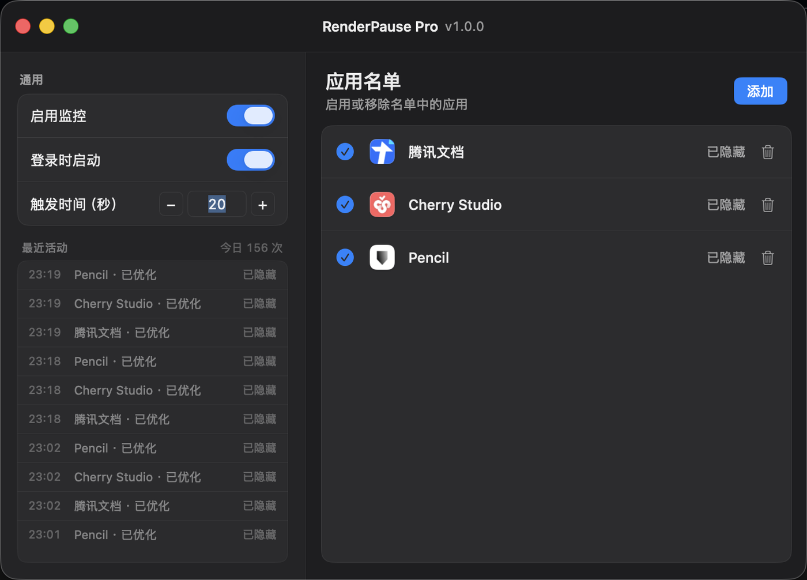
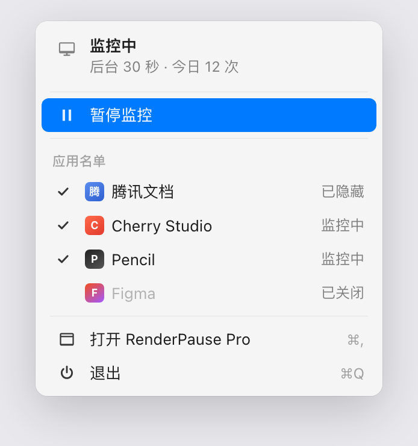

# RenderPause Pro

**解决 M 系列芯片 macOS 闲时 GPU 占用过高** 的菜单栏工具。

日常写代码、看网页、切窗口，和以前一样。  
它只在名单应用**你已经不用、又被完全挡住**时自动隐藏，减轻 WindowServer 对后台图层的持续合成，从而压低闲时 GPU、发热和耗电；需要时再切回去，窗口照常出现。

| 项目 | 说明 |
|------|------|
| 版本 | v1.0.0 |
| 系统 | macOS 26+ · Apple Silicon |
| 形态 | 菜单栏常驻（无 Dock 图标） |
| 策略 | 仅「隐藏」（不注入、不挂起进程） |

完整说明 → **[docs/USER-GUIDE.md](docs/USER-GUIDE.md)**

---

## 要解决什么

| 现象 | 常见原因 |
|------|----------|
| 人已经在干别的事，GPU / WindowServer 仍偏高 | 后台窗口图层仍在被合成 |
| 笔记本发热、风扇响、续航掉得快 | 统一内存上，合成开销更容易传导 |
| Pencil、腾讯文档、Discord 等「挂着不用也费电」 | 静止窗口仍占渲染 / 合成路径 |

在 macOS 上不能像部分 Windows 工具那样挂钩第三方 Metal 循环。本工具走系统公开能力：**隐藏** → 系统停止对其图层的持续合成 → 闲时 GPU 下来。  
**你正在看、正在点的前台工作不受影响**；它不加速前台，只收掉「闲着还在合成」的那一段。

---

## 界面预览

**偏好设置** — 通用设置、最近活动与应用名单



**菜单栏** — 状态、暂停/恢复、名单与退出（对齐当前 UI）



---

## 怎么用（30 秒）

1. 运行 App，点菜单栏图标 → **打开 RenderPause Pro**
2. **添加**需要管的应用（仅名单内生效；日常其他 App 完全不动）
3. 确认 **启用监控**，按需改 **触发时间**（默认 30 秒）
4. 照常工作：名单应用被完全挡住并超过阈值后，才会自动隐藏
5. 需要时再切回 → 立即恢复显示

**菜单栏：** 状态 · 暂停/恢复监控 · 名单（✓ / 状态字）· 打开窗口 · 退出  
**偏好窗：** 左：通用 + 最近活动 · 右：应用名单（状态 + 垃圾桶移除）

---

## 何时才会动手（防误伤）

同时满足才隐藏：

1. 在名单且已启用  
2. 监控总开关打开  
3. 不是常规前台  
4. 窗口**完全遮挡**（露出一点也不藏）  
5. 持续达到触发秒数  
6. 不是分屏搭档保护对象  

输入法 / 本工具前台不会误判你的工作窗。  
不满足条件时，一切与没装本工具时相同。

---

## 构建

```bash
cd "/path/to/RenderPause Pro"
xcodegen generate   # 改过 project.yml 时
xcodebuild -scheme RenderPausePro -destination 'platform=macOS' -configuration Debug build
xcodebuild -scheme RenderPausePro -destination 'platform=macOS' -configuration Debug test
```

安装示例：

```bash
APP=$(ls -d ~/Library/Developer/Xcode/DerivedData/RenderPausePro-*/Build/Products/Debug/RenderPausePro.app | head -1)
pkill -x RenderPausePro 2>/dev/null || true
cp -R "$APP" /Applications/RenderPausePro.app
open /Applications/RenderPausePro.app
```

---

## 权限

| 能力 | 权限 |
|------|------|
| 隐藏（当前主路径） | **不需要**辅助功能 |
| 最小化（代码保留，界面默认关闭） | 需辅助功能 |
| 登录时启动 | 系统登录项 |
| 遮挡 / 前台检测 | 公开 API，无需「输入监控」 |

不注入第三方进程，不读应用内数据。

---

## 文档

| 文档 | 内容 |
|------|------|
| [docs/USER-GUIDE.md](docs/USER-GUIDE.md) | 问题背景、使用、规则、排障（完整说明） |

---

## 不做的事

- 挂钩 / 修改第三方 Metal Command Buffer  
- `SIGSTOP` 挂起进程  
- 未加入名单的「全家桶清理」  
- 夸张「已省电 xx%」仪表盘  
- 改变你正在使用的前台体验  

---

私有项目 · Copyright © 2026 · [GitHub](https://github.com/winskymobile/RenderPause-Pro)
